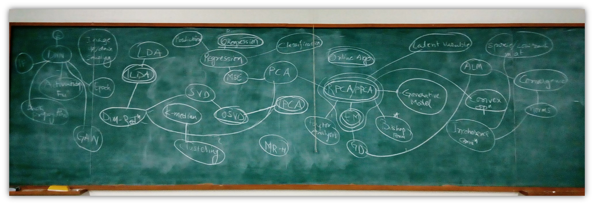

# Algorithms and Optimization for Big Data
## School of Engineering and Applied Science, Ahmedabad University

### Faculty
Prof. Ratnik Gandhi [Profile](https://ahduni.edu.in/seas/people/faculty/ratnik-gandhi)
### Teaching Assistant
Rahul Patel [Pofile](https://www.google.com)
### Course Brief
This is a PG course (open as a technical elective to senior UG). The course will evolve around reading and implementation of state of the art literature in streaming algorithms related to big data problems. The objective of this course is to expose students with state of the art literature in the area of algorithms designing specifically for big data (focusing on streaming algorithms and related optimization problems). Student taking this course will develop an ability to independently take up a problem related to big data, model it and design a relevant solution.

This will be a Laboratory-class based course. Every week we will meet for a 3 hours session. During this session we will be discussing one or two ideas from reference research papers. Further, in this session, you (students) will be implementing these ideas in relevant software systems

### Evaluation
<table>
  <th>Type</th>
  <th>Weightage</th>
  <th>Description</th>
  
  <tr>
  <td>Midterm Project</td>
  <td>30%</td>
  <td>A 3 Week project individual project - Implementation of an existing research paper.</td>
  </tr>
  
  <tr>  
  <td>Endterm Project</td>
  <td>30%</td>
  <td>A 7 Week project group project - Implementation and extention of an existing research paper.</td>
  </tr>
  
  <tr>  
  <td>Endterm Take-home</td>
  <td>40%</td>
  <td>A one week individual assignment - Propose solution/s for the open-ended problem provided.</td>
  </tr>
</table>

### Submissions
List of assignments with solutions.
#### Online Regression
John Doe [repo](https://www.google.com)

#### Online Singular Value Decomposition
John Doe [repo](https://www.google.com)

#### Robust Principle Component Analysis (Midterm Project)
John Doe [repo](https://www.google.com)

#### Probabilistic Principle Component Analysis (PPCA) using Expectation Maximization
John Doe [repo](https://www.google.com)

#### Incremental Principle Component Analysis
John Doe [repo](https://www.google.com)

#### Generative Adversarial Network using PPCA (Endterm Project)
John Doe [repo](https://www.google.com)

#### Endterm Take-home
John Doe [repo](https://www.google.com)

### List of repository
[Link](https://www.google.com) to the excel file containing list of student repositories.

### Useful Resources
Blogs, Softwares, Tutorials
#### Softwares
<ul>
  <li> [Tensorflow](https://www.tensorflow.org) </li>
</ul>

### References

1. Multi-Dimensional Regression Analysis of Time-Series Data Streams, Chen et al., Proceedings of the 28th VLDB Conference, Hong Kong, China, 2002.
2. Linear Programming in the Semi-Streaming Model with Applications to the Maximum Matching Problem, Ahn and Guha, Arxiv 2011.
3. Fast Low-Rank Modifications of the Think Singular Value Decomposition, M Brand, Elsevier 2006.
4. Parallel and Collaborative filtering for Streaming Data, Ali, Jhonson, Tang, 2011.
5. Streaming Algorithm for the SVD, Strumpen, Hoffmann, Agarwal, MIT LCS Technical Memo 2003.
6. Matrix Factorization for Collaborative Prediction, Kleeman, Hendersen, Denuit.
7. Generalized Hebbian Algorithm for Incremental Latent Semantic Analysis, Gorrell and Webb.
8. Analytic challenges in Social Sensing, Abdelzaher and Wang.
9. Detecting anomaly in data streams by fractal model, Zhang et al., WWW 2014.
10. Eigenspace Method for Spatiotemporal Hotspot Detection, Fanaee- T and Gama, Arxiv 2014.
11. Chandima Hewa Nadungodage, Yuni Xia, Fang Li, Jaehwan John Lee, and Jiaqi Ge. Streamfitter: a real time linear regression analysis system for continuous data streams. In Database Systems for Advanced Applications, pages 458{461. Springer, 2011.
12. Haitao Zhao, Pong Chi Yuen, and James T Kwok. A novel incremental principal component analysis and its application for face recognition. Systems, Man, and Cybernetics, Part B: Cybernetics, IEEE Transactions on, 36(4):873{886, 2006.
13. Pang, Shaoning, Seiichi Ozawa, and Nikola Kasabov. "Incremental linear discriminant analysis for classification of data streams." IEEE Transactions on Systems, Man, and Cybernetics, Part B (Cybernetics) 35, no. 5 (2005): 905-914.
14. Aggarwal, Charu C. "Outlier analysis." In Data Mining, pp. 237-263. Springer International Publishing, 2015.
15. Aggarwal, Charu C. "A Survey of Stream Clustering Algorithms." (2013): 231-258.
